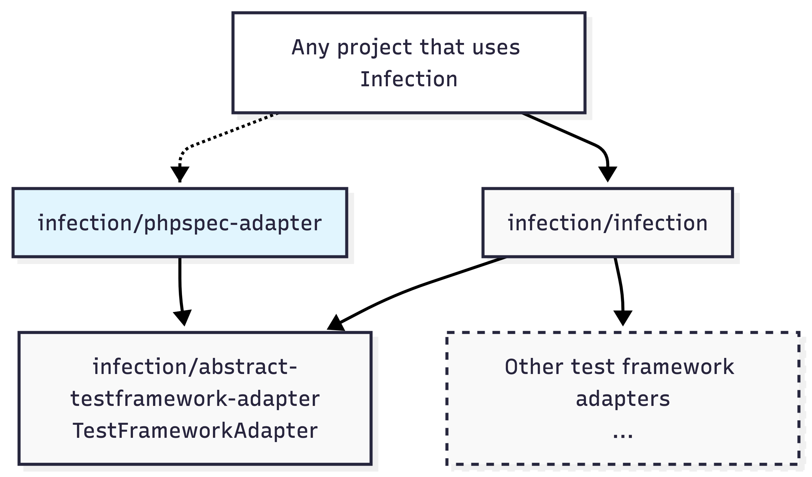

[](https://github.com/infection/phpspec-adapter)
[](https://coveralls.io/github/infection/phpspec-adapter?branch=master)

# PHPSpec Test Framework Adapter for Infection

This is a repository for PHPSpec Test Framework Adapter



### Installation

All you need to install PHPSpec Test Framework adapter is to run:

```bash
composer require --dev infection/phpspec-adapter
```

It will be automatically registered in the Infection runtime.

### Infection - Mutation Testing Framework

Please read documentation here: [infection.github.io](http://infection.github.io)

Twitter: [@infection_php](http://twitter.com/infection_php)
